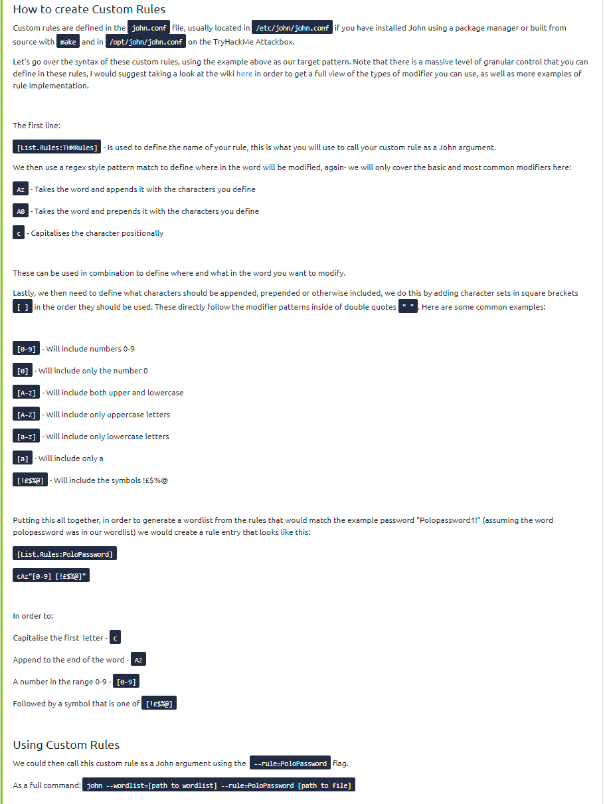

# john the ripper

## Usage

```bash
john --wordlist=WORDLISTT FILE [--format=FORMAT] [--rules=RULE]
john --list=formats | grep -iF HASH-FORMAT
```

## /etc/shadow

```bash
unshadow [path to passwd] [path to shadow] > unhshadowed.txt
john --format=<format> --wordlist=<path> unshadowed.txt

# path-to-passwd: The file that contains the copy of the /etc/passwd file you've taken from the target machine
# path-to-shadow: The file that contains the copy of the /etc/shadow file you've taken from the target machine
```

## zip | rar | ssh | gpg |

```bash
zip2john FILE.zip > zip.hash
fcrackzip -D -p <wordlist> FILE.zip
rar2john FILE.rar > rar.hash
ssh2john.py id_rsa > ssh.hash
gpg2john KEY > gpg.hash
pdf2john.py FILE.pdf > pdf.hash
```

## custom rules (from TryHackMe guide)


